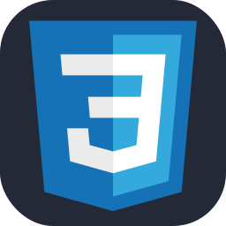
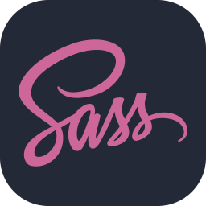
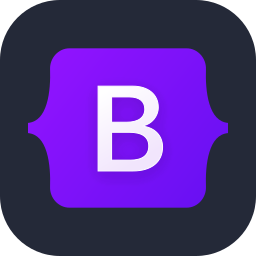
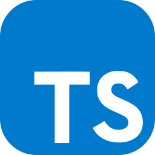
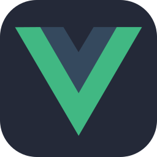
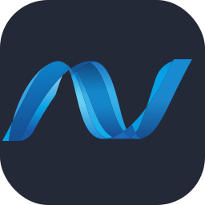
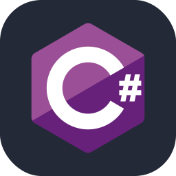
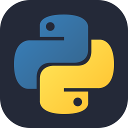
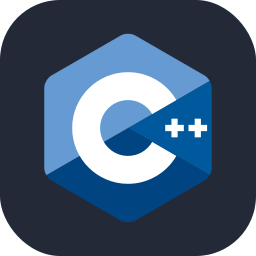
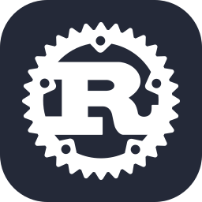

<h1 align="center">Hi there :wave: my name is Patrick, known as Ulti :smile:</h1>

<h2 align="center">I'm a student :mortar_board: at the Bialystok Technical University :classical_building: and an employee :briefcase: of DS360</h2>

<h3>:point_right: Full-Stack Universal Developer</h3>

 

 

 

 

 

### :iphone: Socials

### :globe_with_meridians: Hosted Projects

[ :heavy_check_mark: ] Course completed. Project written. 
[ :grey_question: ] Course in progress. Project in progress. 
[ :x: ] Course in plans. Project in plans. 

### :hammer_and_wrench: Languages | Technologies

<ul>
  <li>[ :heavy_check_mark: ] HTML</li>
  <li>[ :heavy_check_mark: ] CSS</li>
    <ul>
      <li>[ :heavy_check_mark: ] SCSS & SASS</li>
      <li>[ :heavy_check_mark: ] Bootstrap</li>
    </ul>
  <li>[ :heavy_check_mark: ] JavaScript</li>
    <ul>
      <li>[ :heavy_check_mark: ] AJAX & Fetch</li>
      <li>[ :heavy_check_mark: ] jQuery</li>
      <li>[ :heavy_check_mark: ] Axios</li>
      <li>[ :heavy_check_mark: ] TypeScript</li>
      <li>[ :grey_question: ] Vue</li>
    </ul>
  <li>[ :x: ] C++</li>
  <li>[ :heavy_check_mark: ] .NET C#</li>
     <ul>
        <li>[ :heavy_check_mark: ] Language Integrated Query (LINQ)</li>
        <li>[ :heavy_check_mark: ] Entity Framework Core (EF Core)</li>
        <li>[ :heavy_check_mark: ] WPF</li>
        <li>ASP .NET Core</li>
          <ul>
            <li>[ :heavy_check_mark: ] Web API</li>
            <li>[ :heavy_check_mark: ] MVC</li>
            <li>[ :heavy_check_mark: ] Razor Pages</li>
            <li>[ :x: ] Blazor</li>
          </ul>
     </ul>
  <li>[ :heavy_check_mark: ] Python</li>
     <ul>
        <li>[ :heavy_check_mark: ] Django</li>
        <li>[ :grey_question: ] Flask</li>
     </ul>
  <li>[ :x: ] Rust</li>
  <li>[ :heavy_check_mark: ] SQL</li>
  <li>[ :heavy_check_mark: ] Regex</li>
</ul>

[ :heavy_check_mark: ] Mastered 
[ :grey_question: ] Used 
[ :x: ] Planned 

### :card_file_box: Databases

<ul>
  <li>[ :heavy_check_mark: ] Microsoft SQL Server + SSMS</li>
  <li>[ :grey_question: ] Oracle SQL + Oracle SQL Developer</li>
  <li>[ :heavy_check_mark: ] SQLite</li>
  <li>[ :x: ] MySQL</li>
  <li>[ :x: ] PostgresSQL</li>
  <li>[ :grey_question: ] MongoDB</li>
</ul>

### :cloud: Cloud Technologies

<ul>
  <li>[ :grey_question: ] Microsoft Azure</li>
  <li>[ :x: ] Google Cloud Platform</li>
</ul>

### :gear: Engines

<ul>
  <li>[ :grey_question: ] Unity</li>
  <li>[ :x: ] Unreal Engine 5</li>
</ul>

### :link: Others

<ul>
  <li>[ :heavy_check_mark: ] Emmet</li>
  <li>[ :heavy_check_mark: ] Webpack</li>
  <li>[ :heavy_check_mark: ] Postman</li>
  <li>[ :grey_question: ] Docker</li>
</ul>

<h3 align="center">:wave: <i>See You Later, Alligator!</i> :crocodile:</h3>
