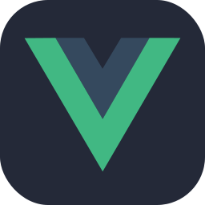

<h1 align="center">Hi there :wave: my name is Patrick, known as Ulti :smile:</h1>

<h2 align="center">I'm a student :mortar_board: at the Bialystok Technical University :classical_building: and an employee :briefcase: of DS360</h2>

### :point_right: Full-Stack Universal Developer

 

 

 

 

 

### :iphone: Socials

### :globe_with_meridians: Hosted Projects

[ ✔️ ] Course completed. Project written.  
[ ❔ ] Course in progress. Project in progress.  
[ ❌ ] Course in plans. Project in plans.  

### :hammer_and_wrench: Languages | Technologies

- ✔️ HTML  
- ✔️ CSS  
  - ✔️ SCSS & SASS  
  - ✔️ Bootstrap  
- ✔️ JavaScript  
  - ✔️ AJAX & Fetch  
  - ✔️ jQuery  
  - ✔️ Axios  
  - ✔️ TypeScript  
  - ✔️ Vue  
    - ✔️ Vuex  
- ✔️ .NET C#  
  - ✔️ Language Integrated Query (LINQ)  
  - ✔️ Entity Framework Core (EF Core)  
  - ✔️ WPF  
  - ✔️ ASP .NET Core  
    - ✔️ Web API  
    - ✔️ MVC  
    - ✔️ Razor Pages  
- ✔️ Python  
  - ✔️ Django  
  - ✔️ Flask  
  - ✔️ SQLAlchemy  
  - ✔️ Artificial Intelligence & Machine Learning  
    - ✔️ Scikit Learn  
    - ✔️ TensorFlow 2.0  
- ❔ Rust  
- ✔️ SQL  
- ✔️ Regex  

[ ✔️ ] Experienced  
[ ❔ ] Familiar  
[ ❌ ] Planned 

### :card_file_box: Databases

- ✔️ Microsoft SQL Server + SSMS  
- ❔ Oracle SQL + Oracle SQL Developer  
- ✔️ SQLite  
- ❔ PostgreSQL  
- ❔ MariaDB  
- ❔ MongoDB  

### :cloud: Cloud Technologies

- ❔ Microsoft Azure  
- ❔ Google Cloud Platform  

### :link: Tools & Others

- **Development**
  - ✔️ JSON, XML, YAML
  - ✔️ Emmet
  - ✔️ Webpack

- **API & Testing**
  - ✔️ Swagger
  - ✔️ Postman

- **DevOps & Virtualization**
  - ✔️ Virtual Machines
  - ✔️ Docker

### :mortar_board: Fundamentals

- ✔️ Git
- ✔️ Algorithms and Data Structures
- ✔️ Design Patterns

<h3 align="center">:wave: <i>See You Later, Alligator!</i> :crocodile:</h3>
