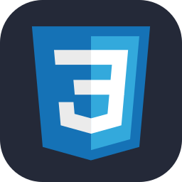
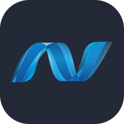
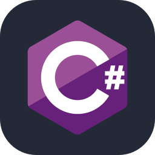
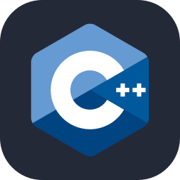

<h1 align="center">Hi there :wave: my name is Patrick, known as Ulti :smile:</h1>

<h2 align="center">I'm a student :mortar_board: at the Bialystok Technical University :classical_building: and an employee :briefcase: of DS360</h2>

### :point_right: Full-Stack Universal Developer

 

 

 

 

 

### :iphone: Socials

### :globe_with_meridians: Hosted Projects

[ ✔️ ] Experienced  
[ ❔ ] Familiar  
[ ❌ ] Planned 

### :hammer_and_wrench: Languages | Technologies

- ✔️ HTML  
- ✔️ CSS  
  - ✔️ SCSS & SASS  
  - ✔️ Bootstrap  
- ✔️ JavaScript  
  - ✔️ AJAX (XMLHttpRequest)
  - ✔️ Fetch API
  - ✔️ jQuery  
  - ✔️ Axios  
  - ✔️ TypeScript  
  - ✔️ Vue  
    - ✔️ Vuex  
- ✔️ .NET C#  
  - ✔️ Language Integrated Query (LINQ)  
  - ✔️ Entity Framework Core (EF Core)  
  - ✔️ WPF  
  - ✔️ ASP .NET Core  
    - ✔️ Web API  
    - ✔️ MVC  
    - ✔️ Razor Pages
    - ❌ Blazor  
- ✔️ Python  
  - ✔️ Django  
  - ✔️ Flask  
  - ✔️ SQLAlchemy  
  - ✔️ Artificial Intelligence & Machine Learning  
    - ✔️ Scikit Learn  
    - ✔️ TensorFlow 2.0  
- ❔ C/C++    
- ❔ Rust  
- ✔️ SQL  
- ✔️ Regex  
- ✔️ JSON, XML, YAML  

### 💾 Databases

- ✔️ Microsoft SQL Server
- ✔️ PostgreSQL
  - ✔️ PostGIS
- ❔ Oracle SQL
- ❔ MariaDB
- ✔️ SQLite
- ❔ MongoDB

### ☁️ Cloud Technologies

- ❔ Microsoft Azure  
- ❔ Google Cloud Platform

### 🎮 Engines
- ❔ Unity 2D/3D
- ❌ Unreal Engine 5

### 🎓 Fundamentals

- ✔️ Git
- ✔️ Object-Oriented Programming (OOP)
- ✔️ Algorithms and Data Structures
- ✔️ Design Patterns
- ❔ Clean Code

### 📐 Concepts & Techniques  
- ✔️ RESTful APIs  
- ✔️ Session Management  
- ✔️ Stored Procedures  
- ✔️ Scaffolding  
- ❔ RSA Cryptography

### 🖥️ Operating Systems

- ✔️ 🪟 Windows
- ❔ 🐧 Linux (Ubuntu, Debian, Raspberry Pi OS)
- ❔ 🍎 macOS

### 📝 IDEs

- ✔️ Visual Studio
- ✔️ Visual Studio Code

### ⚙️ Tools & Others

- **Development**
  - ✔️ Emmet
  - ✔️ Webpack

- **API & Testing**
  - ✔️ Swagger
  - ✔️ Postman
 
- **Database Tools**
  - ✔️ SSMS
  - ❔ Oracle SQL Developer
  - ❔ DBeaver

- **DevOps & Virtualization**
  - ✔️ Virtual Machines (VM)
  - ✔️ Docker

### 💼 Professional Experience
- **DS360 – Full-Stack & ML Developer**  
  *July 2024 – Present*  

  🎨 Frontend Development – Building web application using Vue.js.  

  🎮 Simulation Development – Working with Unity (3D).  

  🛠️ Machine Learning Operations – Deploying and maintaining models, supporting MLOps platform development:  
  - ✔️ PostgreSQL & PostGIS  
  - ✔️ OpenStreetMap (OSM) data processing  
  - ✔️ Machine Learning (Scikit-Learn, H2O)  
  - ✔️ Flask  
  - ✔️ Docker  
  - ✔️ Google Cloud Platform: BigQuery, GCS, Composer, UDFs  

  📊 Project Management – Leading project, coordinating team, and managing schedules.

<h3 align="center">:wave: <i>See You Later, Alligator!</i> :crocodile:</h3>
